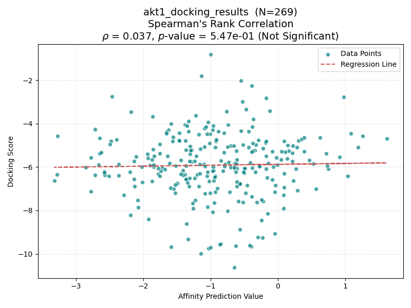
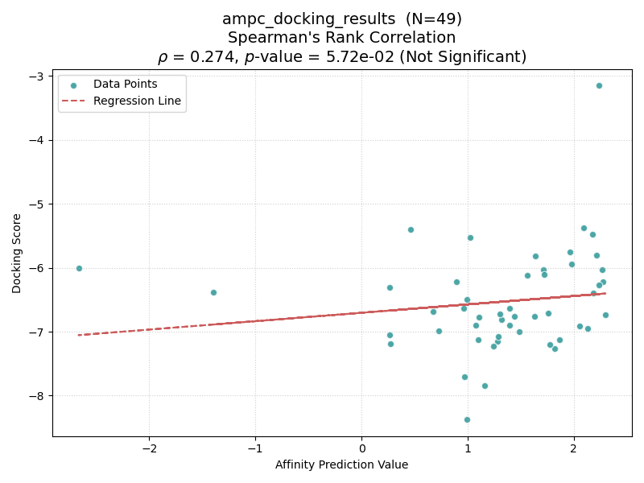
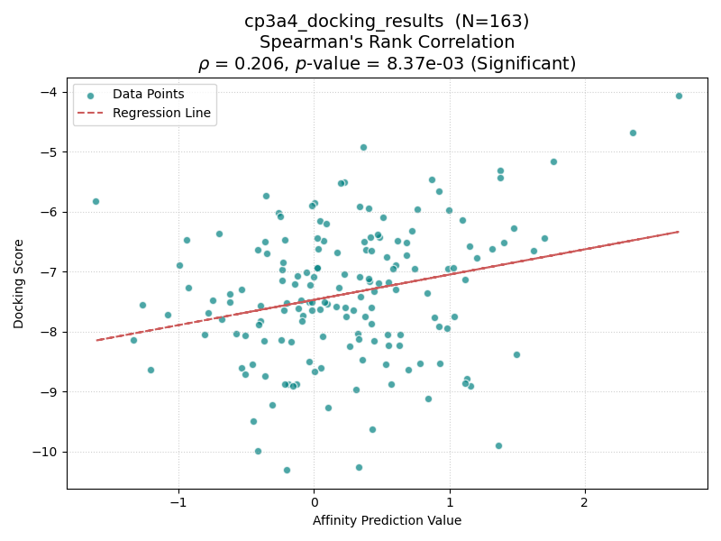
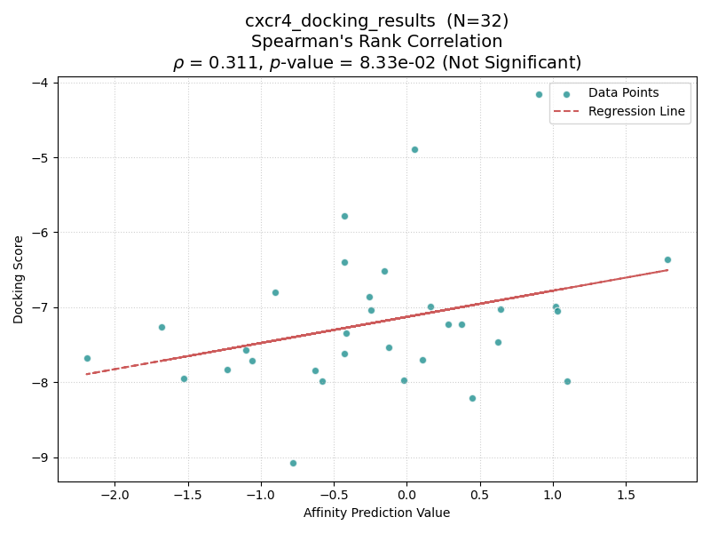
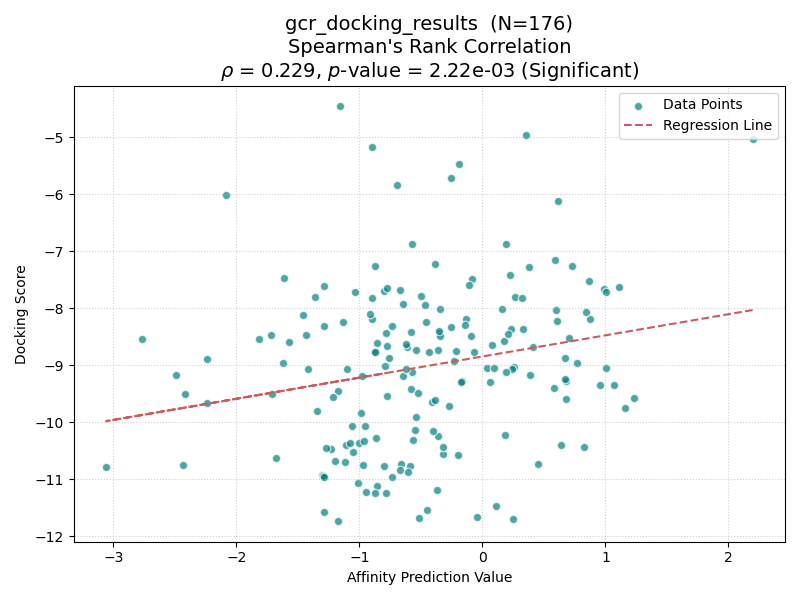
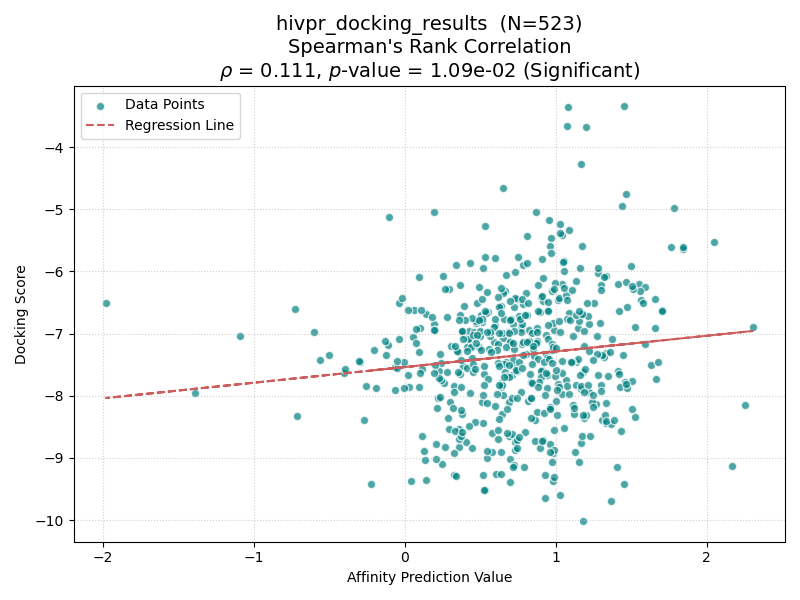
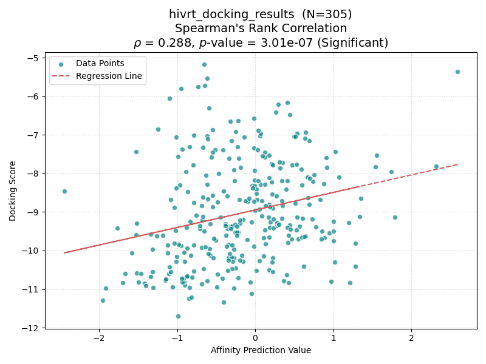
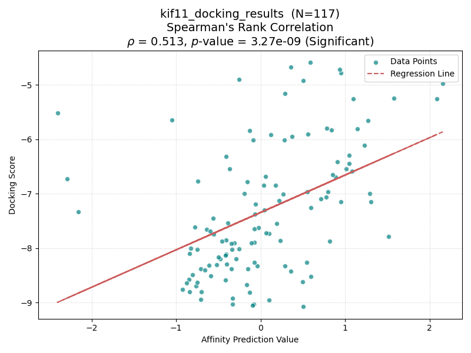

## Abstract

**Boltz-2**[^Boltz2]のAffinity Prediction Valueと**Schrodinger_Glide**[^glide]のDocking Scoreの相関を**DUD-E**[^dude] Diverse datasetの8標的に含まれるactive化合物について検証した．順位差検定を行った結果，有意差が見られたタンパク質とそうでないタンパク質に分かれた．

## Method

### DUD-E Diverse Dataset

DUD-Eはタンパク質-リガンドの結合親和性予測シミュレーションツールのベンチマークデータセットの一つである．DUD-EデータセットのうちDiverseデータセットはDUD-E全体のデータを特徴づけるサブセットであり，本研究では8タンパク質を対象に扱った．

### Boltz Setup

Boltzでは標的タンパク質のアミノ酸配列と評価対象のリガンドのSMILESを入力に受け取って親和性予測を行う．Boltz親和性予測の場合には標的タンパク質の結晶リガンドの位置と同じ位置を狙った結合親和性予測は保証されず，ポケットでないところに結合した場合の結合親和性予測を行う場合がある点に注意したい．

Boltzの設定では，標的タンパク質のアミノ酸配列はDUD-Eで提供されている`receptor.fasta`を用いた．評価対象のリガンドのSMILESは`actives.sdf.gz`から**RDkit**[^rdkit]のcanonical SMILES変換を用いて出力されたSMILESを用いた．Boltz-2で出力される値のうち，`affinity_pred_value`を用いた．

### Glide Setup
GlideはSchrodinger社が提供する商用のソフトウェア群`Glide Suite`に含まれるドッキングシミュレーションソフトウェアにである．本研究では複数ある計算精度のうちSPモードを用いた．

結晶タンパク質について結晶リガンドの位置に評価対象のリガンドが結合するようにGrid boxを設定した．DUD-Eで提供されている`receptor.pdb`か，読み込めない場合には同PDBIDの結晶データをPDBから取得し，同ソフトウェア環境に含まれる準備ツールを用いて前処理を行った．そののち`Grid Box Generation`で結晶リガンドを設定するが，前述のpdbファイルの指定に関わらずDUD-Eで提供されている`crystal_ligand.mol2`が指定する位置をGrid boxの位置とした．Glideで計算した値のうち，Docking Scoreを用いた．

## Experiments

### Metrics

Spearmanの順位差検定を用いた．有意水準は5%とした．

### Experimental Settings

TSUBAME 4.0 gpu_1を用いた．

|構成要素|製品・性能|
|:---:|:---|
|CPU|AMD EPYC 9654 2.4 GHz @ 8 core|
|RAM|DDR5-4800 @ 96 GB|
|GPU|NVIDIA H100 SXM5 94GB HBM2e x1|

ソフトウェア環境は以下に示す．

|ソフトウェア名|バージョン|
|:---:|:---:|
|Glide|Schrodinger Suite 2017-4|
|Boltz-2|2.2.1|
|RDKit|2025.09.3|
|Python|3.10.14|

## Result
いかに結果を示す．横軸がBoltz-2のAffinity Pred Value，縦軸にGlideのDocking Scoreを示す．各点はDUD-Eデータセットに含まれるactive化合物を表し，前処理に成功した点のみ示す．点線は回帰曲線を表す．有意差検定の結果はタイトルに示す．

||
|:---:|
|AKT1|

||
|:---:|
|AMPC|

||
|:---:|
|CP3A4|

||
|:---:|
|CXCR4|

||
|:---:|
|GCR|

||
|:---:|
|HIVPR|

||
|:---:|
|HIVRT|

||
|:---:|
|KIF11|

### Discussion
ポケットの深さを測るために結晶リガンドの大きさを計算した．

|Target| MW| LabuteASA| H-Donors|
|:---:|---:|---:|---:|
|AKT1| 274.71| 130.02| 2|
|AMPC| 355.37| 150.97| 2|
|CP3A4*| 718.95| 367.26| 4|
|CXCR4| 408.68| 223.42| 3|
|GCR*| 489.64| 264.54| 3|
|HIVPR*| 578.80| 307.05| 1|
|HIVRT*| 353.42| 185.40| 1|
|KIF11*| 462.54| 235.65| 2|

<small> $\ast p<0.05 $ (Significant) </small>

結果を上表に示す。興味深いことに、Boltz-2とGlideのスコア相関の有意性は、共結晶リガンドの分子サイズ（Molecular WeightおよびLabuteASA）と強い関連が見られた。

具体的には、分子量（MW）が450を超えるターゲット（CP3A4, GCR, HIVPR, KIF11）では、すべてのケースで有意な相関（p < 0.05）が確認された。一方、分子量が小さいターゲット（AKT1, AMPC, CXCR4）では相関が得られない傾向にあった。

この結果は、以下の理由によるものと考察できる：

1.  **ポケットの定義と認識 (Pocket Definition):**
    大きなリガンドが結合するターゲットは、深く大きな結合ポケットを有する場合が多い。このような構造的特徴が明確なポケットに対しては、Boltz-2のBlind Dockingアプローチでも結合サイトを正確に特定しやすく、その結果Glide（指定されたポケットへのドッキング）との高い一致が見られたと考えられる。

2.  **結合の自由度 (Binding Ambiguity):**
    逆に、リガンドが小さい（AKT1など）場合、結合サイトが浅い、あるいはタンパク質表面の平坦な領域に結合している可能性がある。このようなケースでは、AIモデルが厳密な結合ポーズを特定することが難しく、物理ベースのドッキングスコアとの相関が低くなった可能性が示唆される。

なお、HIVRTは低分子量（MW: 353）であるにもかかわらず有意な相関を示したが、これはHIVRTの非ヌクレオシド系阻害剤結合ポケット（NNIBP）が、低分子であっても特異性が高く、深い疎水性ポケットを形成するという既知の構造的特徴と一致する。

以上のことから、Boltz-2の親和性予測性能は、ターゲットタンパク質のポケットの「深さ」や「形状の明確さ（Distinctness）」に依存する可能性が示唆された。

## Conclusion

本研究では、AIベースの相互作用予測モデルである Boltz-2 と、物理ベースのドッキングシミュレーションである Schrödinger Glide の予測値の相関を、DUD-E Diverse Datasetに含まれる8つの標的タンパク質を用いて検証した。

実験の結果、両者のスコア相関はターゲットによって明確に分かれる結果となった（Spearmanの順位相関 $\rho$ : 0.037 〜 0.513）。特に、共結晶リガンドの分子サイズ（MW, LabuteASA）が大きいターゲット群 において、一貫して有意な正の相関が確認された。

この傾向は、Boltz-2が採用しているBlind Docking（ポケット位置を指定しない結合予測）の特性を反映していると考えられる。すなわち、リガンドが大きく深く埋没するような「明確で深いポケット（Well-defined pockets）」を持つターゲットに対しては、AIモデルも物理シミュレーションと同様の結合モードを再現しやすいことが示唆された。一方で、リガンドが小さく結合サイトが浅い、あるいは表面的なターゲット（AKT1など）では、ポケットの特定自体が難易度を高め、スコアの乖離に繋がったと推測される。

今後は、検証対象のターゲット数を拡大するとともに、Boltz-2におけるポケット指定（Prompting）が可能になった場合の精度の変化や、より多様な相互作用様式を持つタンパク質に対する適用可能性についてさらなる検証が期待される。

### Acknowledgement
本研究は、文部科学省の卓越大学院プログラムの補助をいただき、東京科学大学のスーパーコンピュータTSUBAME4.0を利用して実施した。

---
## References
[^Boltz2]: boltz-2 https://pmc.ncbi.nlm.nih.gov/articles/PMC12262699/
[^glide]: Glide https://pmc.ncbi.nlm.nih.gov/articles/PMC12262699/
[^dude]: DUD-E https://pubs.acs.org/doi/full/10.1021/jm300687e
[^rdkit]: RDKit https://www.rdkit.org/